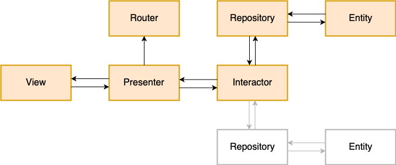
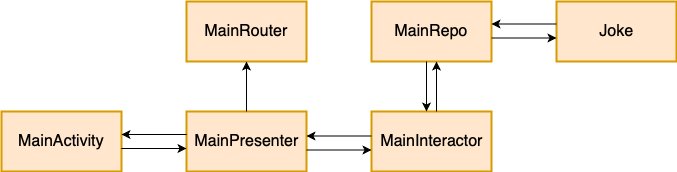

## Android VIPER Architecture Example 

This repository contains a detailed sample client-server app that implements VIPER(View-Interactor-Presenter-Entity-Router) architecture in Android (Kotlin).

Read the full article explaining the project [here](https://medium.com/omisoft/https-medium-com-omisoft-viper-in-android-the-practical-guide-or-how-to-catch-a-snake-78cc17e96d63)

## VIPER Module Diagram 

Structure of VIPER module

## Example Module Class Diagram

Structure of "Main" module from the example project.

## Dependencies
The sample app is using next libraries and frameworks:
- [Dagger 2](https://google.github.io/dagger/)
- [RxJava](https://github.com/ReactiveX/RxJava)
- [Retrofit](https://square.github.io/retrofit/)
- [OkHttp](https://square.github.io/okhttp/)

## References
- [Android Architecture Blueprints repository](https://github.com/googlesamples/android-architecture)

If you have any suggestions or questions feel free to make a Pull Request or contact us!

## Author
#### Alexander Borovskoy
Android developer at [OmiSoft](https://omisoft.net)

## License
Android Viper Architecture Template is released under the MIT license.  
See the [LICENSE](./LICENSE.md) for details.
